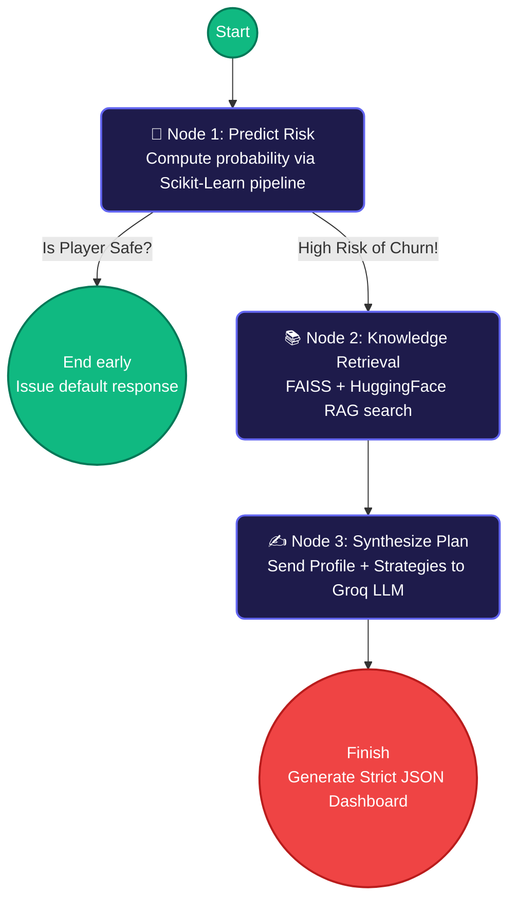

<br/>
<div align="center">
  <h1 align="center">🎮 Agentic AI: Game Engagement Optimizer (ChurnIQ)</h1>
  <p align="center">
    <strong>An advanced, autonomous AI Assistant for Predicting & Preventing Player Churn.</strong>
  </p>
  <p align="center">
    
    
    
    
    
  </p>
</div>

---

## 🌟 Overview
**ChurnIQ** is an End-Semester capstone project representing the evolution of standard machine learning predictive modeling into a modern **Agentic AI Workflow system**. 

Rather than stopping at *identifying* high-risk players (Milestone 1), the system now features a deeply integrated **Agentic Brain** (Milestone 2). When a player is flagged to quit, this Assistant dynamically queries a local strategy database (RAG) and uses LLaMA 3.1 to generate a customized retention blueprint to keep the player engaged.

---

## 🧠 System Architecture

Our platform is powered by a Tri-layered Architecture:

### 1. The Machine Learning Engine (Scikit-Learn)
- Acts as our first line of observation.
- We run standard Random Forest classifiers trained dynamically via the Streamlit backend to gauge the player's statistical `churn_probability`.
- *Data Note*: The original `online_gaming_behavior_dataset.csv` did not contain an explicit "Churn" row, so the ML engine computes the labels based on deriving `EngagementLevel` thresholds.

### 2. The Retrieval-Augmented Generation (RAG) Framework
- Powered by `FAISS` and HuggingFace's `all-MiniLM-L6-v2` local embeddings.
- Injects expert knowledge. By storing proven "Game Engagement Strategies" inside `data/engagement_strategies.csv`, the Agent searches and fetches only the strategies relevant to a specific user's behavioral footprint.

### 3. The LangGraph Agent (Workflow & State)
- The execution orchestrator managing explicit state transitions and fallback logic.



---

## 🚀 Key Interface Features

- **Tab 1: Dataset Explorer:** Inspect raw tables, visualize feature scaling, and preview data histograms to ensure data hygiene.
- **Tab 2: Interactive ML Training:** Select subsets of features, adjust Random Forest hyper-parameters (e.g. `n_estimators`), and trigger training on the fly. Generates detailed Evaluation metrics (Precision, Recall, ROC-AUC) and Confusion matrices.
- **Tab 3: Predict & Prevent (Agentic output):** A robust form where you tweak a fictional player's settings (e.g., Level, age, playtime hours) to cast an execution query to our LLM Workflow. Generates 5 distinct analytical pillars: *Summary*, *Analysis*, *Action Plan*, *References*, and *Ethical Disclaimers*.

---

## 🗂️ Project Structure

| File / Folder             | Description |
| :------------------------ | :---------- |
| **`app.py`**              | The master Streamlit UI code routing the frontend logic. |
| **`src/agent.py`**        | Core Agent definitions handling LangGraph `StateGraph`, `START`, and `END` nodes utilizing `ChatGroq`. |
| **`src/rag.py`**          | Setup and loading scripts for the FAISS Vector Database searching our local ruleset. |
| **`src/pipeline.py`**     | Essential Data Preprocessing handling OneHotEncodings and column-specific scaling algorithms. |
| **`src/data_loader.py`**  | Handles CSV reading operations and target variable manipulation. |
| **`data/`**               | Contains the gaming ML dataset and the new `engagement_strategies.csv` list. |

---

## 📦 Setup & Installation

### 1. Environment Configuration
Ensure your python installation meets the requirements, and download the packages natively:
```bash
git clone <repository_url>
cd ChurnIQ-main
python3 -m pip install -r requirements.txt
```

*(Note: Ensure `python-dotenv`, `langchain_community`, `langchain_huggingface` and `torchvision` are resolved in your local environment.)*

### 2. Enter API Keys
Create a `.env` file at the root folder level and input your Groq key required for the LLaMA 3.1 inference engine:
```env
GROQ_API_KEY="gsk_your_api_key_goes_here"
```

### 3. Run the Dashboard
Execute the native Streamlit application:
```bash
python3 -m streamlit run app.py
```
Open **[http://localhost:8501](http://localhost:8501)** in any modern web browser to access the control panel.

---

<div align="center">
  <i>Built for the Final End-Semester Evaluation (Milestone 2) 🏆</i><br/>
  <i>Focus: Explicit State Management, RAG Generation, Workflow Mapping, JSON Structure Generation</i>
</div>
